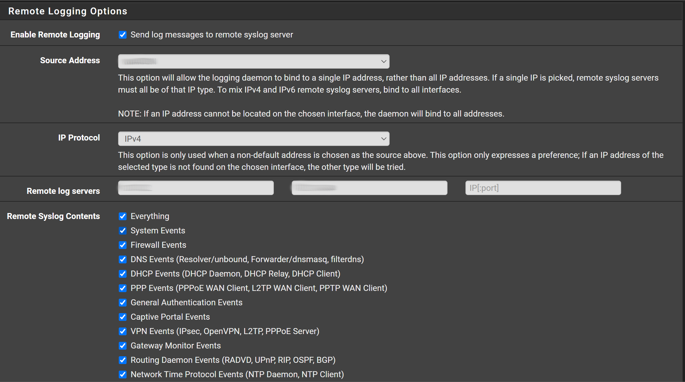

# configuration with pfsense
## pfsense
status -> system logs -> settings

- Enable remote logging
- Configure addres for the remote log server to the address of the server where syslog-to-loki is running
- Configure wht log to send

